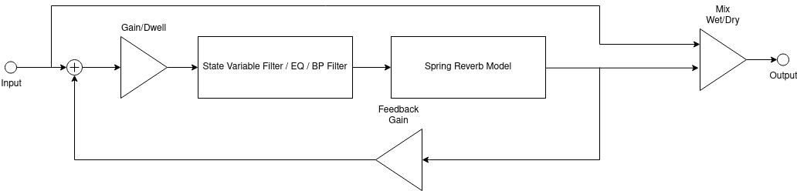

% Entwurf Nachall System mit Faust
% Gruppe 5: Abel | Hadacek | Thiele | Aïssa
% Digitale ASV Jour Fixe 27.04.21

# Ziele
## Hauptziele
- Umsetzung vom Nachhallprojekt aus Audiotechnik in **Faust**
- Programmierung eines SVF Vorfilter
- Erzeugung eines VST Plug-Ins

## Additionnelle Ziele
- Verbesserung des Models
- Eingebettetes System auf Teensy Model 4.0

# Stand am 27.04.21
- Vertraut mir des Faust Sprache: Kadenze Kurs, Litteratur von Julios O. Smith und Romain Michon
- Entwurf der Struktur in Faust:

